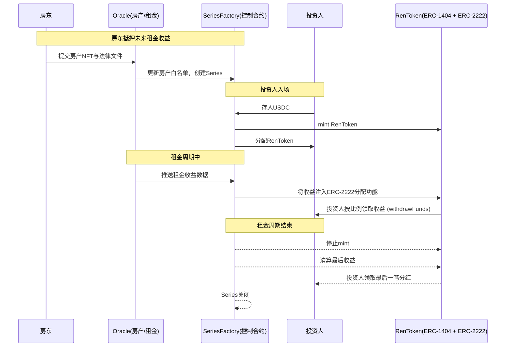

# Rentoken 技术白皮书（v0.1）
## 摘要

Rentoken 是一个面向房产租金收益的 RWA 协议，允许房东将未来 1–5 年的房租应收款上
链，发行合规受限的 ERC20 Token。

每个房产对应一个ERC20 Token，房租定期打入合约，持有人可以随时提取利润。

---

## 系统架构

### 模块组成

1. **Property NFT (ERC-721)**

   - 表征单个房产，元数据包含法律文件哈希与租约信息。
   - 由房东与 Rentoken 实体链下交互完成注册/更新。

2. **KYC Oracle (ERC-3643)**

   - 管理投资人白名单。
   - 仅 KYC 合格的钱包地址可参与投资。

3. **Sanction Oracle**

   - 对接 **Chainalysis Sanctions Oracle**。
   - 提供 `isSanctioned(address)` 接口。

4. **Valuation Oracle**

   - 提供房产未来现金流折现价值（DCF）。
   - 用于确定募资上限（cap）。

5. **SeriesFactory (控制入口合约)**

   - 集中控制入口：
     - 创建新的 Series（ERC-1404 + ERC-2222）。
     - 统一处理投资人入金：`depositUSDC(propertyId, amount)`。
     - 接收租金：`receiveRent(propertyId, amount)`。
     - 调用 Rent Token 的 `mint()` / `distribute()`。
   - 实际成为协议的「Protocol Gateway」。

6. **Rent Token (ERC-1404 + ERC-2222)**

   - ERC-1404：受限转账（仅白名单 + 未被制裁地址）。
   - ERC-2222：Funds Distribution Token，用于分配租金收益。
   - 不再直接接收 USDC（所有资金流通过 Factory 路由）。
   - 仅负责「份额余额 + 收益分配」核心逻辑。
   - **代币命名规则**：采用 `RNT-{房产类型}-{地理位置}-{系列编号}` 格式
     - 示例：`RNT-APT-SH-001`（上海公寓001号）、`RNT-VILLA-BJ-002`（北京别墅002号）
     - 便于投资人识别和监管机构合规审查

7. **Permissioned AMM LPool（可选）**
   - 内部流动性池，项目方提供初始流动性。
   - LP 与交易对手必须满足 KYC + Sanction 检查。

---

## 权限控制 (RBAC)

- **DEFAULT_ADMIN_ROLE**：协议治理、多签持有。
- **PAUSER_ROLE**：紧急暂停协议交互。
- **MINTER_ROLE**：Series 创建与发币。
- **COMPLIANCE_ADMIN_ROLE**：管理合规 Oracles。

> **MVP 版本不支持合约升级**。后续版本采用 UUPS (ERC-1822) + ERC-1967。

---

## 生命周期流程

1. **房东注册房产**

   - `PropertyOracle.mintProperty()`
   - 上链登记法律文件 URI。

2. **投资人 KYC**

   - 地址加入 `KYCOracle`。
   - Sanction 检查实时完成。

3. **发币流程**

   - `SeriesFactory.createSeries()`
   - 部署 ERC-1404 + ERC-2222 Token。

4. **投资人入场**

   - `SeriesFactory.depositUSDC(propertyId, amount)`
   - 内部完成：
     - Sanction + KYC 校验
     - 调用 USDC `permit()`
     - 将资金换取对应 Rent Token。

5. **租金分配**

   - 租客支付租金到 Factory：`receiveRent(propertyId, amount)`
   - Factory 路由到对应 Rent Token 的 `distribute()`。

6. **投资人提取收益**

   - `RenToken.withdrawFunds()`。

7. **合约到期**
   - Series 进入 `Matured` 状态。
   - Factory 停止入金，仅允许提取剩余收益。

---

## 合约接口摘要

### SeriesFactory（核心控制入口）

```solidity
interface ISeriesFactory {
    struct SeriesParams {
        uint256 propertyId;
        address usdc;
        uint64  startTime;
        uint64  maturity;
        uint256 capUSDC;
        string  propertyType;    // 房产类型：APT/VILLA/OFFICE等
        string  location;        // 地理位置：SH/BJ/SZ等
    }

    event SeriesCreated(uint256 indexed propertyId, address series, string tokenName);

    function createSeries(SeriesParams calldata params)
        external returns (address series);

    function depositUSDC(uint256 propertyId, uint256 amount, address receiver)
        external returns (uint256 shares);

    function receiveRent(uint256 propertyId, uint256 amount) external;

    function generateTokenName(uint256 propertyId, string calldata propertyType, string calldata location)
        external view returns (string memory);
}
```

### Rent Token (ERC-1404 + ERC-2222)

```solidity
interface IRentokenSeries {
    function withdrawFunds(address to) external returns (uint256);
    function withdrawableFundsOf(address user) external view returns (uint256);
    function maturity() external view returns (uint64);
}
```

---

## 合约依赖的标准与 EIP

- **ERC-721**：房产登记。
- **ERC-3643**：KYC/合规身份。
- **ERC-1404**：受限转账。
- **ERC-2222**：收益分配。
- **EIP-2612**：USDC 入金 permit 支持。
- **ERC-1822 / ERC-1967**：合约升级（非 MVP）。

---

## 差异化优势

- **集中控制入口**：所有资金流和合规模块在 Factory 统一处理。
- **安全性**：合规逻辑只写一次，减少重复与漏洞面。
- **可升级性**：未来升级只需替换 Factory，Token 保持纯粹。
- **用户体验**：投资人只和 Factory 交互，流程清晰统一。
- **清晰的代币标识**：采用结构化命名规则，便于投资人识别不同房产系列，提升监管合规性。

---

## 路线图

- **MVP (v0.1)**：

  - ERC-721 房产登记
  - ERC-1404 + ERC-2222 系列 Token（结构化命名规则）
  - SeriesFactory 集中控制入口
  - Chainalysis Sanctions Oracle
  - ERC-3643 KYC Oracle
  - USDC 入金（EIP-2612）
  - 简单 RBAC

- **v1.0**：
  - UUPS 升级代理
  - Permissioned AMM 流动性池
  - 多 Series 聚合查询接口
  - 自动化支付代理对接

---

## 风险与合规声明

- **链下法律效力**：房产租金应收权必须有司法效力文件支撑。
- **制裁风险**：依赖 Chainalysis Oracle，更新延迟可能导致合规风险。
- **流动性风险**：早期 AMM 流动性不足。
- **技术风险**：Factory 成为单点合约，需要严格审计与多签控制。


### 流程图


